
[url: "youown.net/works/cf5ae1bb91524afc8d4976cbe8b11927", img: "youown.png", text: "作品Youown链接"]
[url: "www.zcool.com.cn/work/ZNzA0MTI4NDQ=.html", img: "zcool-icon2.png", text: "作品Zcool链接"]


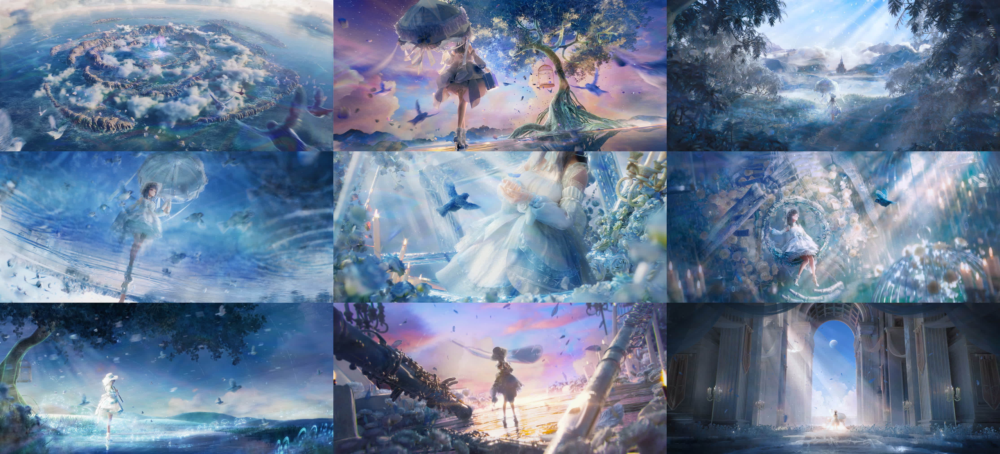

童话的开始，在始终独身一人的利兹身边，某一天突然出现了以为陌生的少女。
两人成了要好的朋友，住在了一起。直到某天利兹发现少女是青鸟的化身。
最后还是分开了，（青鸟）从利兹身边飞走了。

——“想把你留在身边，可却不想剥夺你美丽的翅膀，所以我打开了鸟笼，这是我表达爱的方式。”
——“我想留在你身边，可却不想违背你盼望我自由的心愿，所以我飞离了你的身边，这是我表达爱的方式。”
“我爱你。”

故事的结尾，还是开心的结局更好啊。

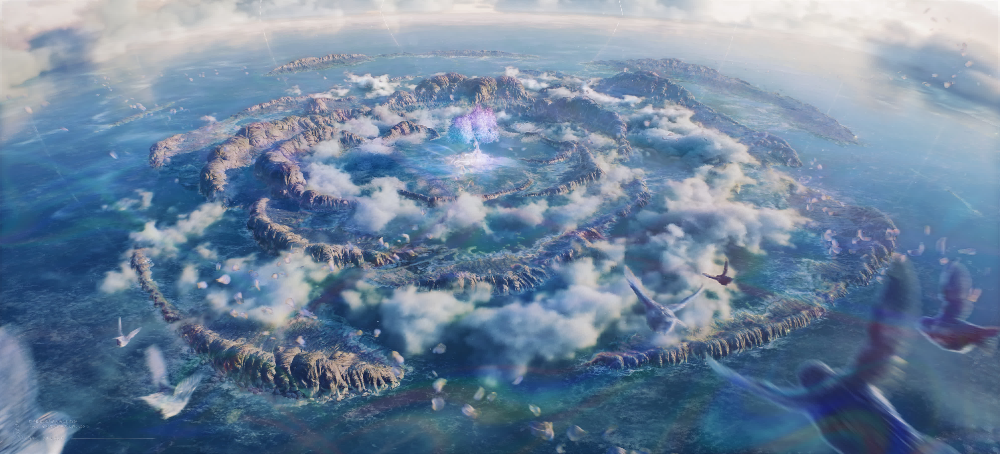

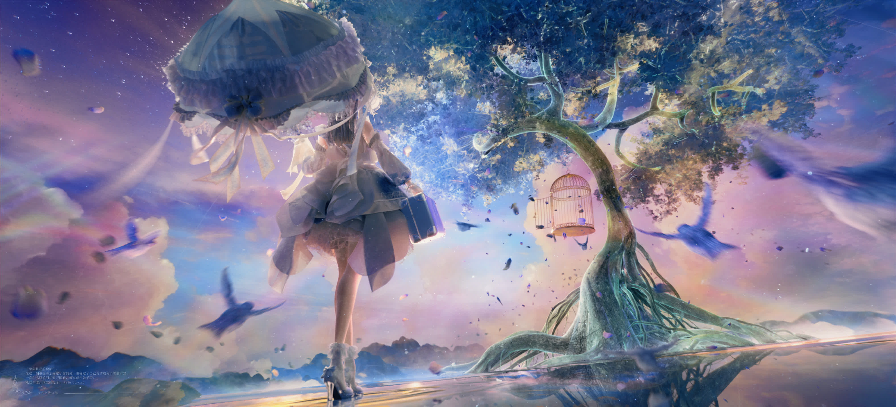

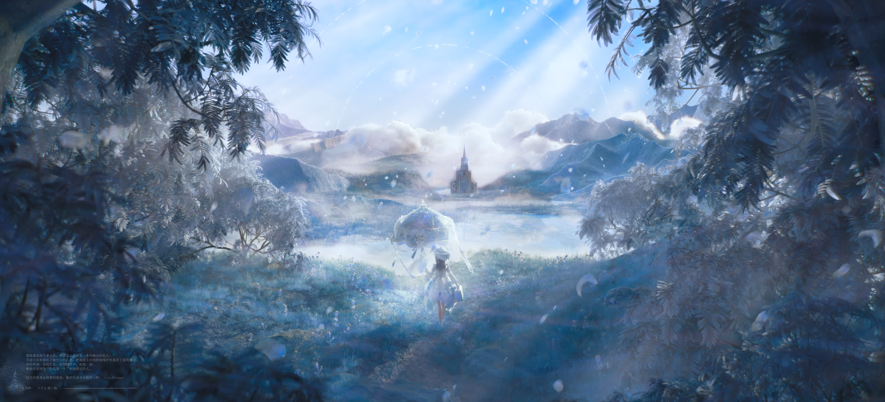

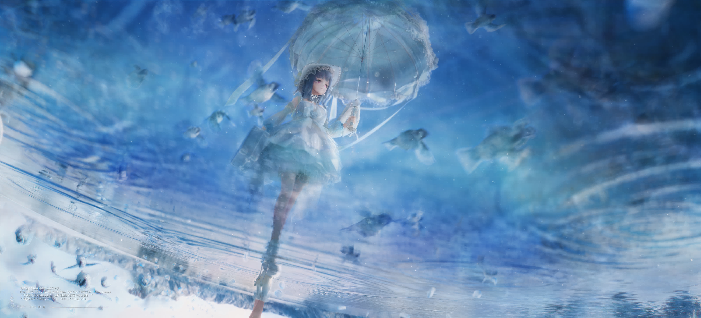

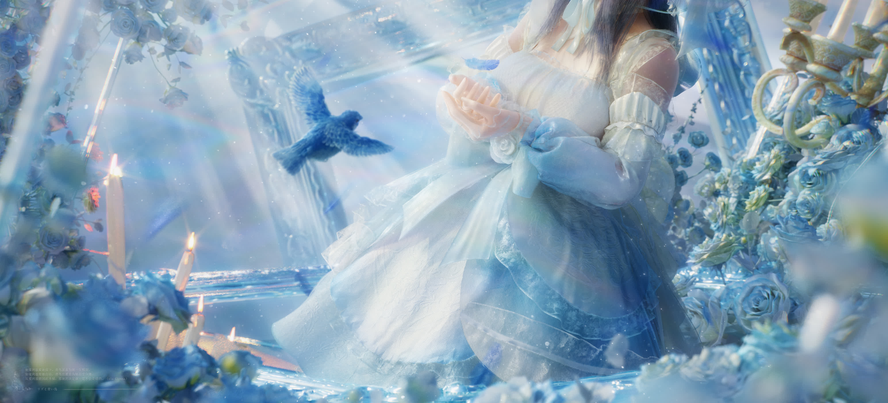

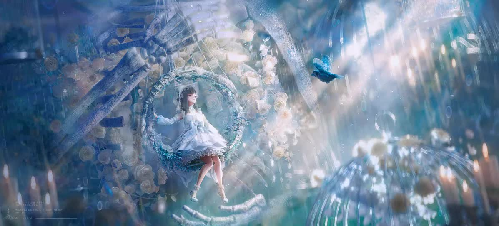

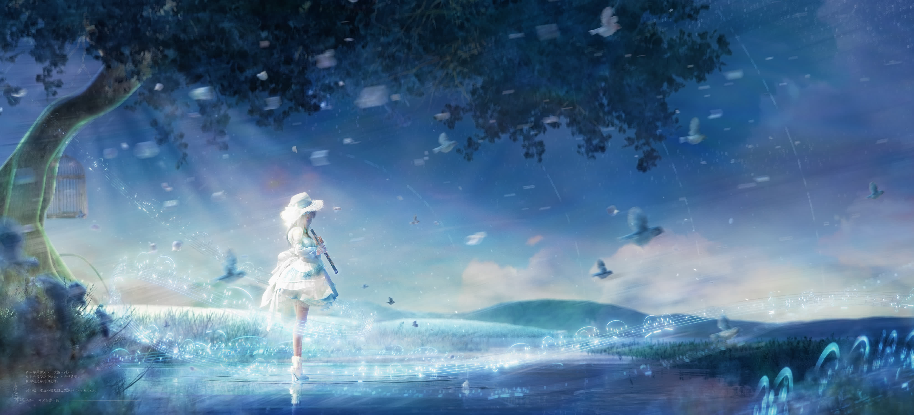

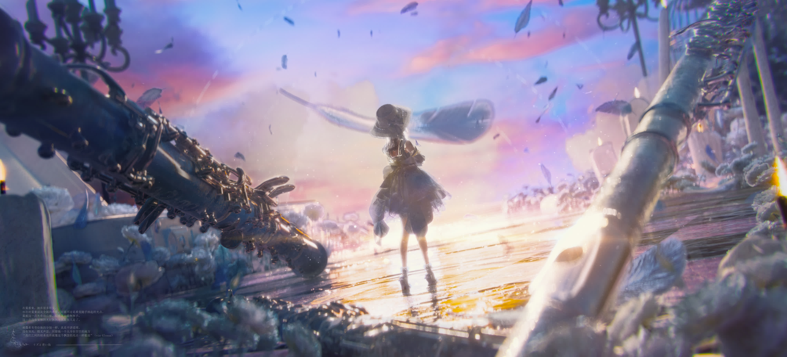

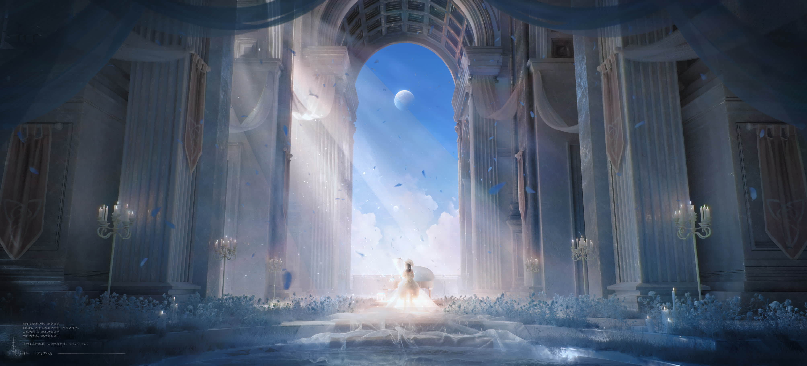

## 设计阐述构思阐述：

构想了一个铠冢霙跟随自己的青鸟伙伴，回到了有可能栖息的山谷。或许在希美难以到达的彼岸，作为青鸟的霙在这片自由浪漫的地域里，不断地涌现各个回忆与想象的切片。

人物原型：《利兹与青鸟》铠冢霙原片

简述：《利兹与青鸟》是京都动画系列作品《吹响吧！上低音号》的番外剧场版，原片围绕两位少女升学与彼此之间的关系，讲述了彼此从迟疑、不安不自信到坚定、放手和爱，极其细腻的情感故事。

服装设计：初印象之中，希美是像人间小太阳的向日葵（沉默的爱），霙是含苞待放的玫瑰（纯洁的爱）。整体服装往玫瑰的外观和元素贴近。早期设计稿往古典系偏，后面拉高腰线使其更像直觉上的花，结合洋伞，更偏向田园系一些。

构成设计：参考了很多插画的设计思路，制作过程又会有新的灵感。现在看来当时找的参考跟成品图半毛钱关系都没有。

## 幕后

“只要不上班每天就能多出8个小时来学习”（点头）。

去年主管无意中的一句话：“你这样这么细微的打光调整，感觉跟在画画一样”，启发了应该往自己之前喜欢的插画、pv、2d动画的各方面探索。写实渲染的目标从来不应该是现实世界，就像画画的对手也不应该是相机一样。

尝试学习绘画里的结构逻辑、构图和色彩，运用大量的光学工具（雾气、吸光体、丁达尔面片、遮光片、虚无光面片、透明发光体）为主的画面塑造。很多时候灯光都是随手一拉，意外地得到了满意的效果。

一直都是凭感觉做，做到快完才知道原来明调的画面属于比较难的级别，给自己上了个不知天高地厚的强度。不过也收获颇多。

这次也借机会把这两年熟手苦手的软件都用上了，与所学所感结合，做阶段性总结，算是真正意义上的“毕业设计”。

十分推荐《利兹与青鸟》这部柔美清新文艺又极其细腻的动画电影，同时搭配兹青嗑糖大师b站up主Gloxxa的《利兹与青鸟》拉片解析，藏在冰山下的情感比电影表现的表层，要多得多。（边看边做边哭）

项目的制作过程也做成了视频放在个人b站上（up：可能是水桶吧）

各个部分的完成时长：RND与总体设计（4天），服装与雨伞建模、uv、解算（17天），地形树木建模（3天），材质绘制（3天）、C4D搭建与资产处理（10天）、渲染（20天）、后期（8天）、发布相关（3天）         

设计软件：Procreate、MarvelousDesigner、SubstancePainter、SpeedTree、GAEA、Blender、Cinema4D、OctaneRender、AfterEffects、Houdini

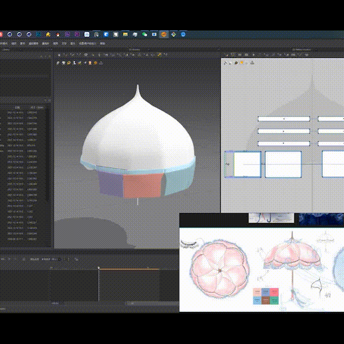

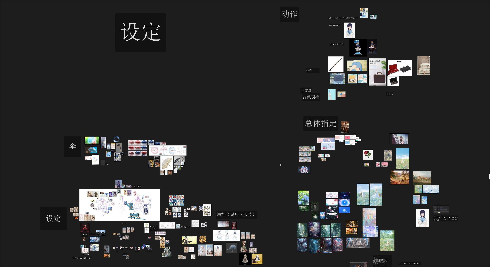

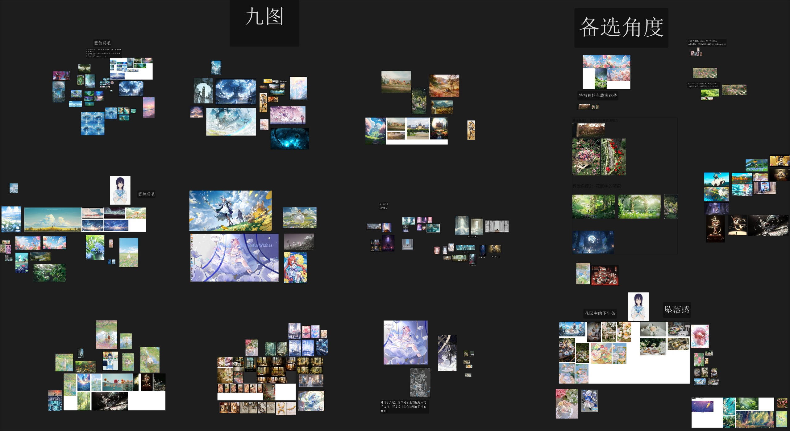

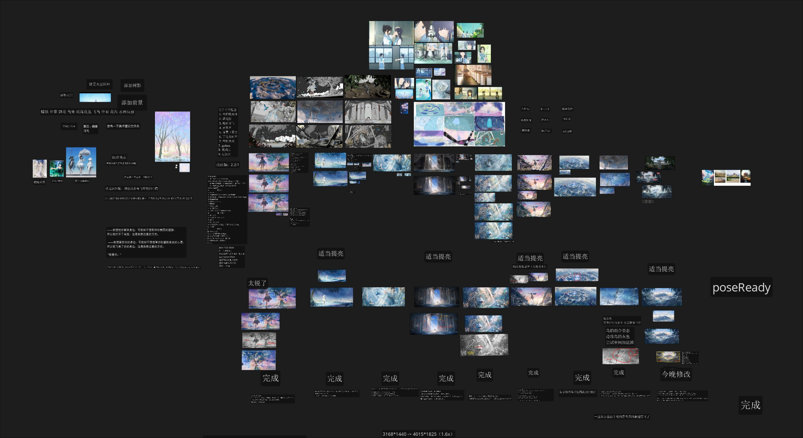

## 感谢

项目管理/整体设计/服装设定/建模/搭建/材质渲染/后期/发布：水桶

色指定：咪卡姜/水桶

Blender人物模型转绑：Rondo

感谢：咪卡姜/Rondo/A梦/曾老师/DQ/KL

感谢一直以来关注作品更新和扩列的各位朋友。
